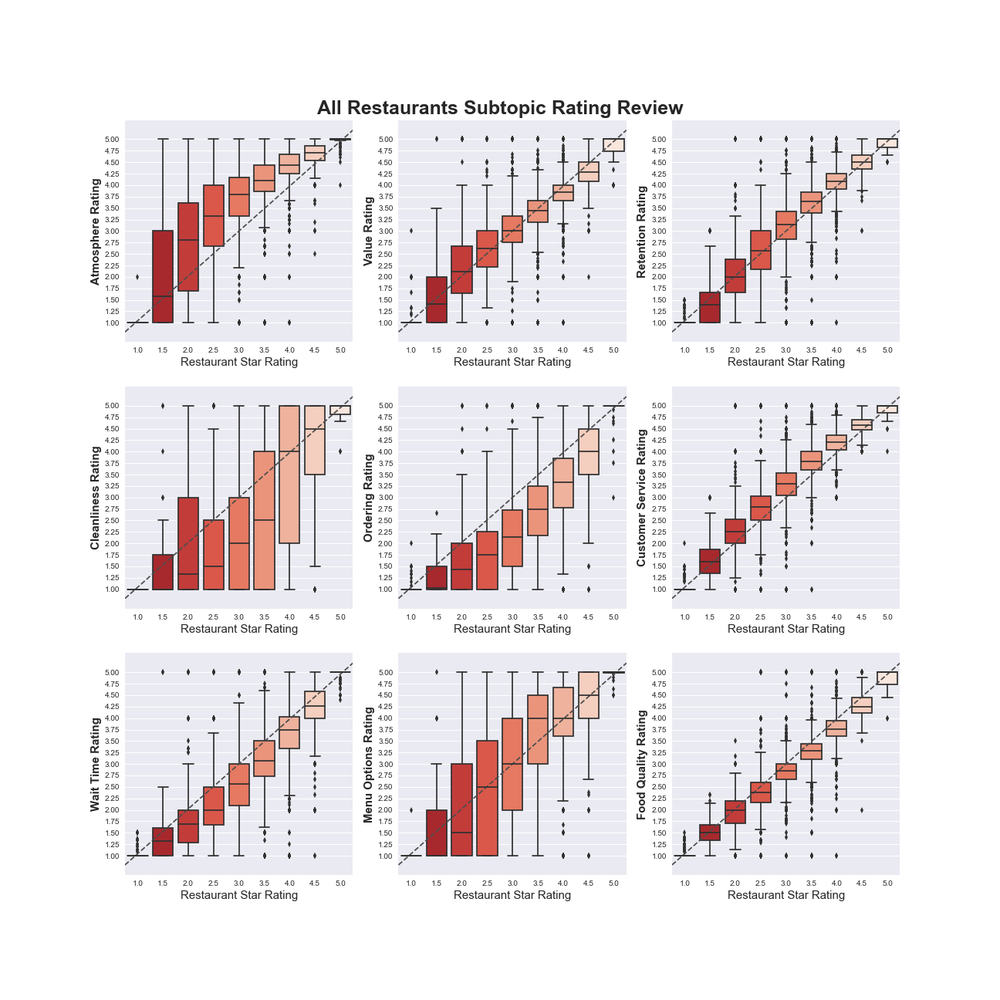
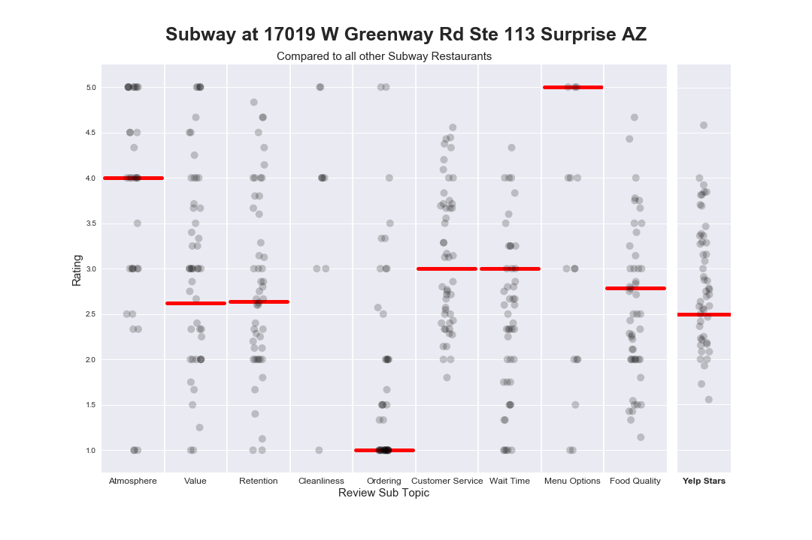
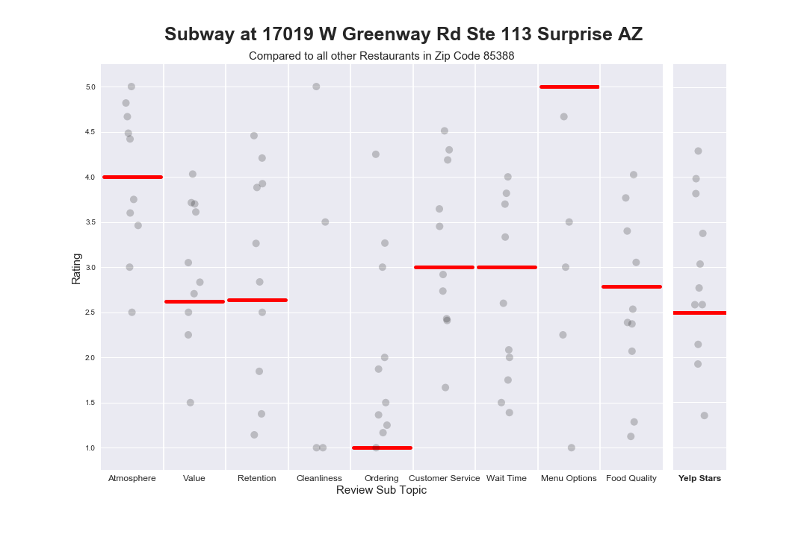
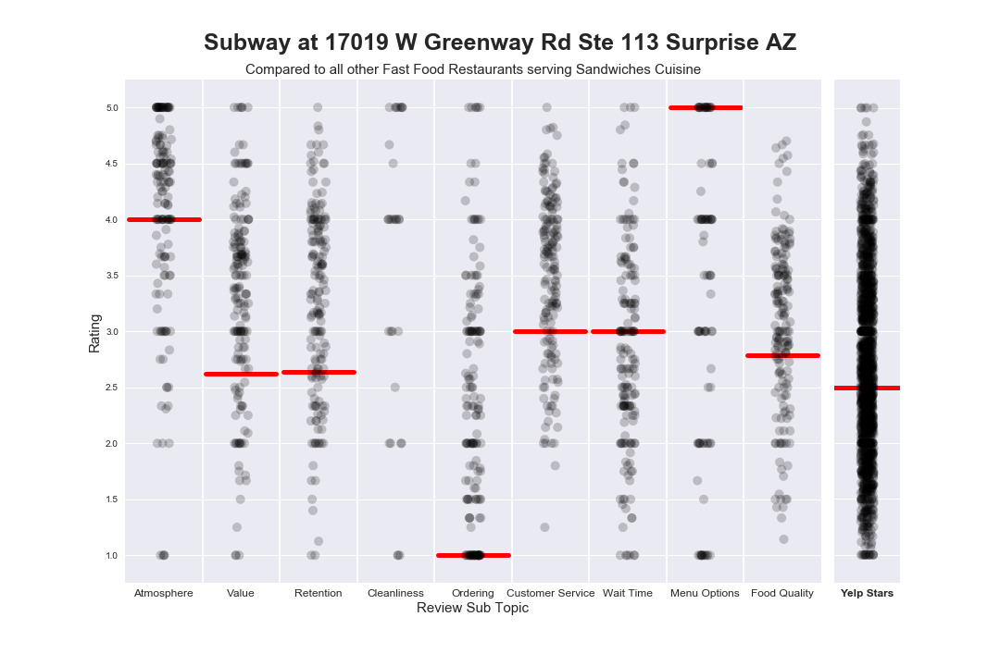
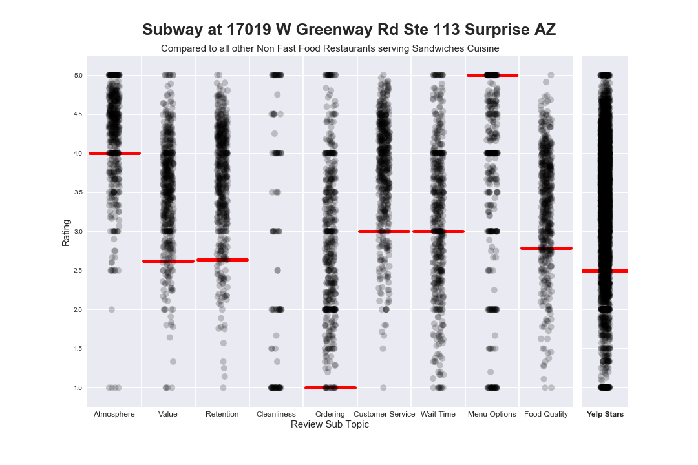
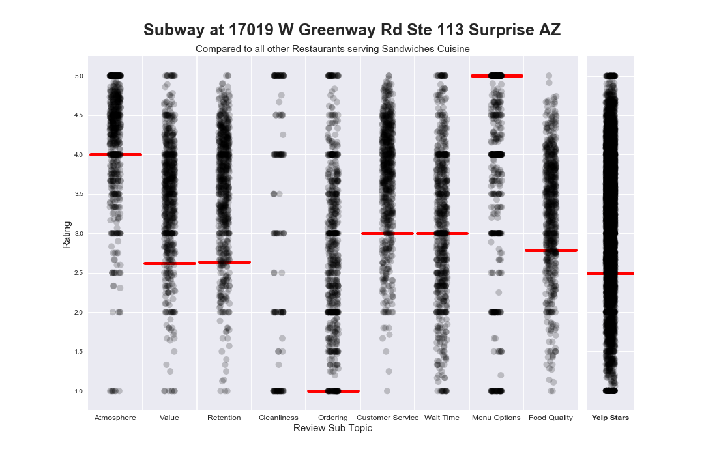

# Extracting Sub Topic Ratings from Yelp Review Text
This project leverages Latent Dirichlet Allocation (LDA) from the `gensim` library  to extract topics from the 496,000 Yelp Reviews given to 7066 Restaurants in the State of Arizona.

# Results
The best Sub Topic Groupings were generated using an Online Latent Dirichlet Allocation model provided by `genesis`.  This Model was trained to identify 50 Topics, with 10 Terms per topic, and given 50 Passes to process the review texts.

Text was tokenized and lemmatized, so that we retained complete English readable words (vs stemming).  The corpus was restricted to only tokens appearing more frequently than the 10,000th most frequently token.  Example	 if the 10,000th token appeared just 3 times, only tokens occurring 4 or more times were kept.

This processing took nearly 13 hours to complete on a 2010 MacBook Pro, so please take that into consideration when attempting to recreate these results.

## Identified Sub Topics
The resulting 50 topics identified by the LDA model were pruned 12 Topics which condensed down to 9 Review Sub Topics.  Identified Topics that were not considered for Sub Topic Ratings included Topics consisting of mostly cuisine specific items, and were topics addressing the type of restaurant, for example ['chicken', 'fried', 'kentucky', 'wings', ...]

```
retention
Topic 1  ['time', 'back', 'first', 'try', 'place', 'went', 'definitely', 'go', 'next', 'great']

food_quality
Topic 3  ['dish', 'flavor', 'sauce', 'like', 'taste', 'menu', 'one', 'would', 'bit', 'meat']
Topic 20 ['food', 'like', 'place', 'ordered', 'tasted', 'bad', 'even', 'back', 'cold', 'taste']
Topic 21 ['good', 'food', 'place', 'price', 'pretty', 'service', 'better', 'like', 'would', 'really']

wait_time
Topic 7  ['wait', 'minute', 'time', 'food', 'get', 'order', 'long', 'line', 'hour', 'waiting']

atmosphere
Topic 8  ['great', 'nice', 'patio', 'atmosphere', 'outside', 'place', 'cool', 'fun', 'inside', 'food']

ordering
Topic 9  ['order', 'ordered', 'called', 'delivery', 'extra', 'got', 'time', 'get', 'card', 'call']

cleanliness
Topic 13 ['table', 'dirty', 'clean', 'bathroom', 'floor', 'plate', 'hand', 'cup', 'paper', 'chair']

menu_options
Topic 19 ['option', 'menu', 'free', 'gyro', 'meat', 'vegetarian', 'veggie', 'choose', 'vegan', 'choice']

customer_service
Topic 27 ['great', 'food', 'service', 'place', 'friendly', 'good', 'recommend', 'staff', 'delicious', 'price']
Topic 44 ['customer', 'manager', 'service', 'back', 'food', 'said', 'time', 'asked', 'one', 'would']

value
Topic 35 ['good', 'really', 'got', 'ordered', 'little', 'nice', 'pretty', 'came', 'portion', 'also']
```


## Assigning Topics to Reviews
To assign a Sub Topic to a review, we count the number of tokens in each review that appear in each Sub Topic.  Note that some Sub Topics include more than one set of tokens.

Each review can be tagged with more than one Sub Topic, being tagged with a subtopic was determined by passing a min token count to the function assigning Sub Topics.

Each Review is given a Sub Topic Rating equal to the original Review Stars the yelper gave their review.  Example,  a Yelper write a 4 Star Review and write in depth about the value and cleanliness of the Restaurant, the `value` and `cleanliness` Sub Topic Ratings will both be set to 4 Stars for that Review, all other Sub Topic Rating are left `(null)` so as not to skew averages for that Restaurant.

## Calculating Restaurant Sub Topic Stars
Calculating the Sub Topic Stars for each Restaurant is easy, and performed the same way Yelp calculates Review Stars. A simple average is applied to each Sub Topic Review Star count, grouped by Restaurant `business_id`.

## Identifying the Most Influential Sub Topics
The chart below shows the distribution of Review Stars as compared to the Restaurant’s Official Yelp Star Rating.  Plots like `Food Quality` at the lower right corner indicate a strong correlation, implying that Food Quality is a key driver in overall Yelp Review Stars. While `Atmosphere` or `Menu Options` are a bit more distributed, indicating that it is likely that a the atmosphere and Cuisine Diversity of a restaurant, even when exceptionally good, does not drive Yelp Review Stars as heavily.



## Comparison Reporting Tool
A comparative report can be derived for any Restaurant.  As an Example, we will look at Subway Restaurant in Surprise, Arizona (Surprise is the name of a city, as surprising as that may be!)

The comparison report includes information on the specified Restaurant as compared to:
* All Other Subway Restaurants
* All Other Restaurants	in the Same Zip Code
* All Other Restaurants Serving a Similar Cuisine
* All Other Restaurants Serving a Similar Cuisine (Fast Food Locations Only)
* All Other Restaurants Serving a Similar Cuisine (Non Fast Food Locations Only)








# Reproduce my Work
Few simple steps to get started and reproduce my work.

## Getting Started
Clone this repo to get started.  From there, if you are using `conda` to manage your virtual environment, run the following command to setup the environment and install the needed packages.  Be sure to pass the included `environment.yml` file.

```
# conda env create environment.yml
```

## Prerequisites
There are a few steps involved in getting `nltk` and `spacy`  up and running.

Run the following commands from the command line to install the NLTK and spaCy package resources needed.  For more documentation on spaCy, follow [this link](https://spacy.io/usage/)

```
# python -m nltk.downloader all
# python -m spacy download en
```

Lastly, the data used for this project is supplied by the [Yelp Open Dataset](https://www.yelp.com/dataset).  You will need to download a copy of the source data and store it in a directory called `source_data` to run these notebooks without making changes to any code.

Specifically, you will need to copy over `business.json` and `review.json` from the downloaded data set to the `source_data` directory.

The starter directory structure should look like this:

```
yelpsubtopics
| -README.md
| -environment.yml
| -.gitignore
| -models
| -clean_data
| -source_data
|   |- business.json
|   |- review.json
| -documents
| -DataWrangling
|   |- 00_Business_Data_Wrangling.ipynb
|   |- 01_Review_Wrangling.ipynb
| -TopicModelling
|   |- model_03a_all_reviews_nouns.ipynb
|   |- model_05_all_reviews.ipynb
|   |- model_02_nff_reviews.ipynb
|   |- MODEL_SUMMARY.ipynb
|   |- model_01_ff_reviews.ipynb
|   |- model_04_all_reviews_nouns_verbs.ipynb
| -SubTopicReviews
|   |- SubTopicTagging_Model5.ipynb
|   |- SubTopic_Investigation.ipynb
|   |- plottingtools
|       |- init__.py
| -scripts
|   |- clean_checkins.py
|   |- clean_users.py
| -charts
|   |- reports
```

## Order of Operations
To successfully reproduce my results, run the notebooks in the following order:

1. DataWrangling/00_Business_Data_Wrangling.ipynb
2. DataWrangling/01_Review_Wrangling.ipynb
3. TopicModelling/model_05_all_reviews.ipynb
4. SubTopicReviews/SubTopicTagging_Model5.ipynb
5. SubTopicReviews/SubTopic_Investigation.ipynb

There are several additional notebooks in the `TopicModelling` directory that can be run and include additional output lda models.  The final results of this project use the model generated by the `model_05_all_reviews.ipynb` notebook.

# Additional Information
## Built With
* [pandas](https://pandas.pydata.org) - Python Data Analysis Library
* [matplotlib](https://matplotlib.org) - Python Plotting Library
* [seaborn](https://seaborn.pydata.org) - statistical data visualization
* [nltk](http://www.nltk.org/) - a suite of libraries and programs for symbolic and statistical natural language processing for English text
* [gensim](https://rometools.github.io/rome/) - Topic Modeling for humans
* [spaCy](https://spacy.io) - Industrial-Strength Natural Language Processing

## Authors
* **Sam Gutentag** - *Initial work* - [samgutentag](www.samgutentag.com)

See other projects by Sam on [Github](https://github.com/samgutentag)

## Acknowledgments
* The [Yelp Open Data Set](https://www.yelp.com/dataset)
* [Simon Worgan](https://www.linkedin.com/in/simon-worgan-44613138/)
* [Springboard](www.springboard.com)
